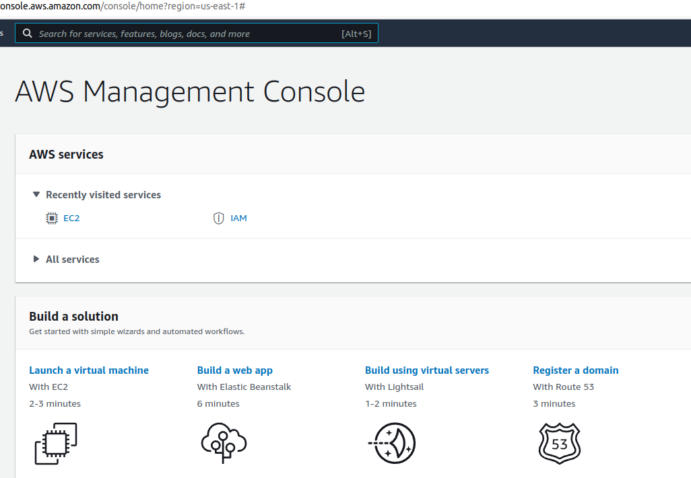
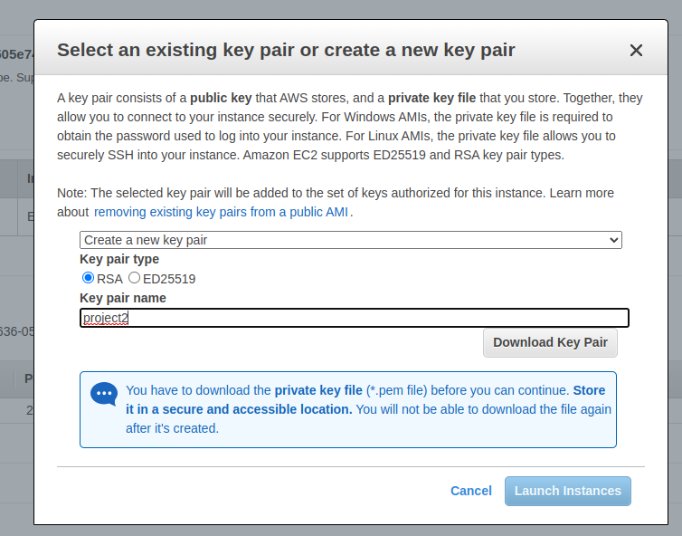

This project will show you the steps I took to set up my LAMP on an EC2 instance.

# **What is a Technology stack?**

A technology stack is a set of frameworks and tools used to develop a software product. This set of frameworks and tools are very specifically chosen to work together in creating a well-functioning software. They are acronymns for individual technologies used together for a specific technology product. some examples are…

- **LAMP** (Linux, Apache, MySQL, PHP or Python, or Perl)
- **LEMP** (Linux, Nginx, MySQL, PHP or Python, or Perl)
- **MERN** (MongoDB, ExpressJS, ReactJS, NodeJS)
- **MEAN** (MongoDB, ExpressJS, AngularJS, NodeJS

Preparing Prerequisites

Spinning up a new EC2 instance (an instance of a virtual server) is only a matter of a few clicks.

You can follow the instructions below  to get yourself set up:

1. Register a new AWS account following [this instruction](https://aws.amazon.com/premiumsupport/knowledge-center/create-and-activate-aws-account/).
2. Select your preferred region (the closest to you) and launch a new EC2 instance of t2.micro family with Ubuntu Server 20.04 LTS (HVM)

*Important*

I am using a windows operating system, so I downloaded a tool call putty to connect to my EC2 Instance. You can watch this video for quick set-up: https://www.youtube.com/watch?v=qw_bZGN7jWI 

Linux
Linux is the operating system for this stack, and the flavor we will be using is Ubuntu.

Installling an OS

 We will be utilising AWS service (Elastic Cloud Computing - EC2 instance) to create a server. To access this feature, you need to first create an account with AWS or sign in if you have an existing account

Click "Launch a virtual machine"

Type in the search bar Ubuntu Sever 20.01 LTS (HVM), SSD, click select.

/home/shanika/Documents/lamp_project/aws images/search ubuntu.png

Next, keep highlighted the selection in the image, and scroll down and click "Review and Launch"

/home/shanika/Documents/lamp_project/aws images/step2.png

On the next page click "Launch"

/home/shanika/Documents/lamp_project/aws images/step7_launch.png

Create and save your key-pair pem file in a secure and accessible location. This will be needed to access your server from your local machine. Click "Download Key Pair" and then click "Launch Instances"

Click what's highlighted in red. Please note your number will be different.

/home/shanika/Documents/lamp_project/aws images/launchinstance.png
/home/shanika/Documents/lamp_project/aws images/ins.png

Connecting to your EC2 instance using PUTTY