This project will show you the steps I took to set up my LAMP on an EC2 instance.

# **What is a Technology stack?**

A technology stack is a set of frameworks and tools used to develop a software product. This set of frameworks and tools are very specifically chosen to work together in creating a well-functioning software. They are acronymns for individual technologies used together for a specific technology product. some examples are…

- **LAMP** (Linux, Apache, MySQL, PHP or Python, or Perl)
- **LEMP** (Linux, Nginx, MySQL, PHP or Python, or Perl)
- **MERN** (MongoDB, ExpressJS, ReactJS, NodeJS)
- **MEAN** (MongoDB, ExpressJS, AngularJS, NodeJS

Preparing Prerequisites

Spinning up a new EC2 instance (an instance of a virtual server) is only a matter of a few clicks.

You can follow the instructions below  to get yourself set up:

1. Register a new AWS account following [this instruction](https://aws.amazon.com/premiumsupport/knowledge-center/create-and-activate-aws-account/).
2. Select your preferred region (the closest to you) and launch a new EC2 instance of t2.micro family with Ubuntu Server 20.04 LTS (HVM)

*Important*

I am using a windows operating system, so I downloaded a tool call putty to connect to my EC2 Instance. You can watch this video for quick set-up: https://www.youtube.com/watch?v=qw_bZGN7jWI 

Linux
Linux is the operating system for this stack, and the flavor we will be using is Ubuntu.

Installling an OS

 We will be utilising AWS service (Elastic Cloud Computing - EC2 instance) to create a server. To access this feature, you need to first create an account with AWS or sign in if you have an existing account

Click "Launch a virtual machine"

Type in the search bar Ubuntu Sever 20.01 LTS (HVM), SSD, click select.

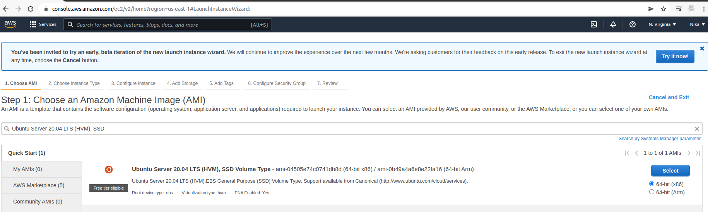

Next, keep highlighted the selection in the image, and scroll down and click "Review and Launch"

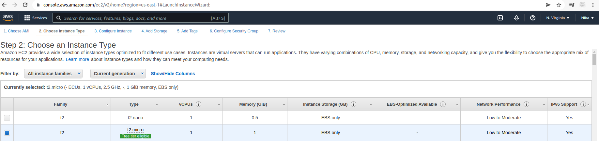

On the next page click "Launch"

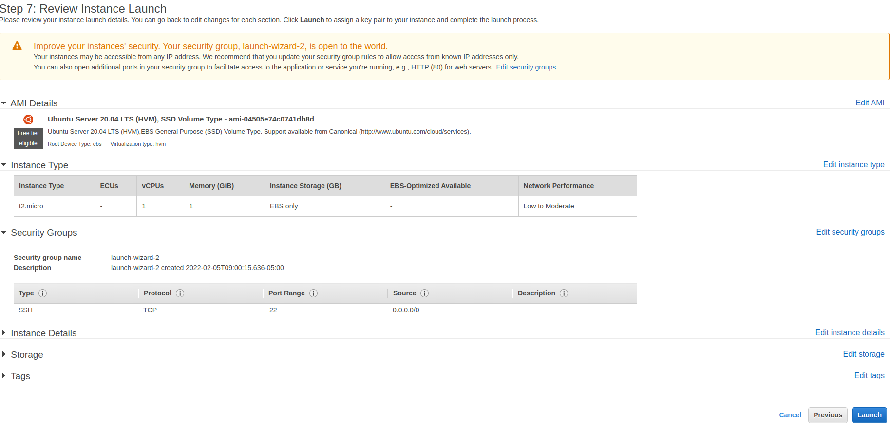

Create and save your key-pair pem file in a secure and accessible location. This will be needed to access your server from your local machine. Click "Download Key Pair" and then click "Launch Instances"

Click what's highlighted in red. Please note your number will be different.

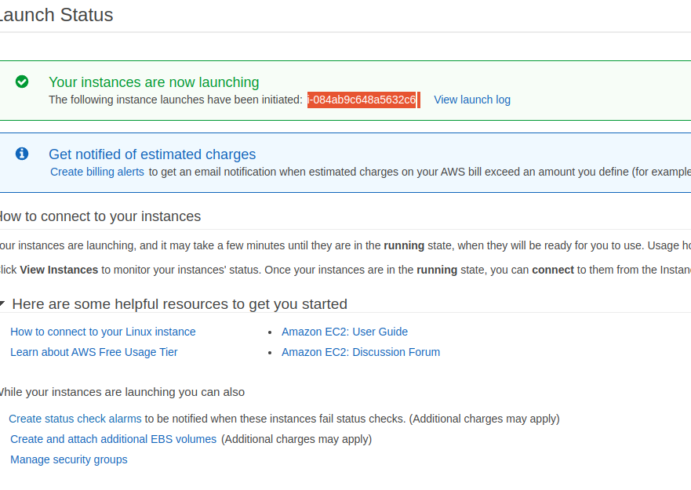
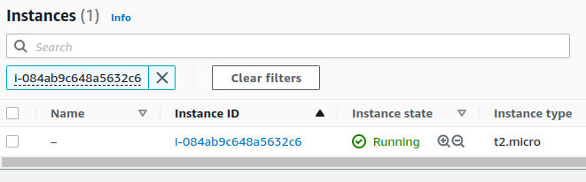

Connecting to your EC2 instance using Terminal

- Change directory into the loacation where your `PEM` file is. Most likely will be in the **Downloads** folder

`cd ~/Downloads`

**IMPORTANT** - Anywhere you see these anchor tags **< >** , going forward, it means you will need to replace the content in there with values specific to your situation. For example, if we need you to replace the name you have saved the private key on your machine, we will write something like **< private-key-name >**.

If the private key you downloaded was named **my-private-key.pem** simply remove the anchor tags and insert **my-private-key.pem** in the command you are required to execute. Lets try this and follow the instructions below to get some work done.

- Change premissions for the private key file (.pem), otherwise you can get an error “Bad permissions”

`sudo chmod 0400 <private-key-name>.pem`

- Connect to the instance by running

`ssh -i <private-key-name>.pem ubuntu@<Public-IP-address>`

Congratulations! You have just created your very first Linux Server in the Cloud and our set up looks like this now: (You are the client)

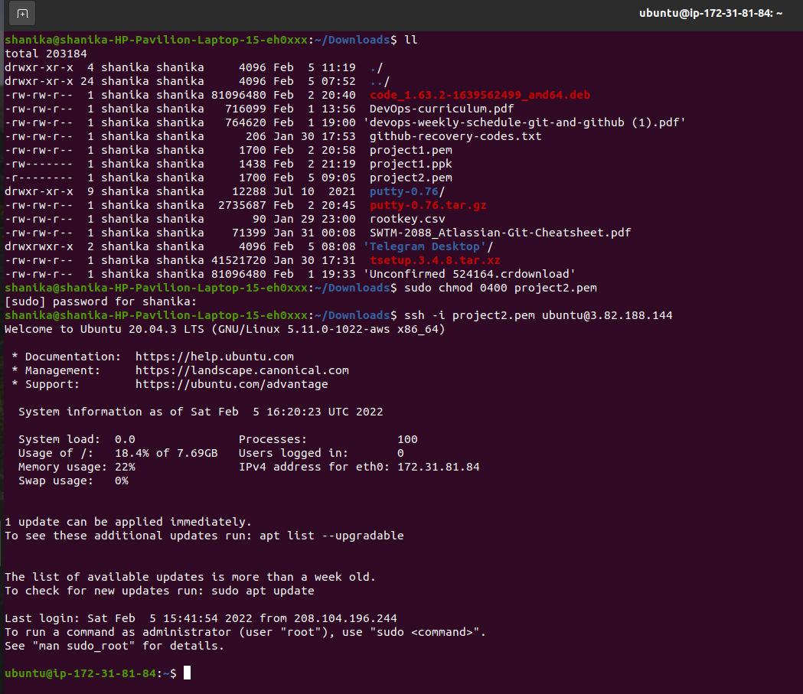

Installing Apache 

Install Apache using Ubuntu’s package manager‘apt’

First update a list of packages in package manager
$ sudo apt update

Then run apache2 package installation
$ sudo apt install apache2`

To verify that apache2 is running as a Service in our OS, use following command

`$ sudo systemctl status apache2`

If it is green and running, then you did everything correctly - you have just launched your first Web Server in the Clouds!

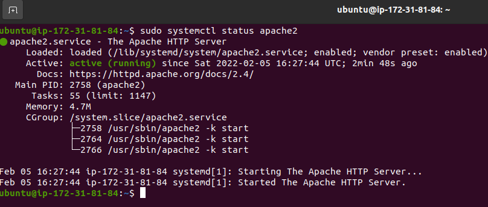

Before we can receive any traffic by our Web Server, we need to open TCP port 80 which is the default port that web browsers use to access web pages on the Internet

As we know, we have TCP port 22 open by default on our EC2 machine to access it via SSH, so we need to add a rule to EC2 configuration to open inbound connection through port 80:

On your instance, go to the security group tab and edit the inbound rules

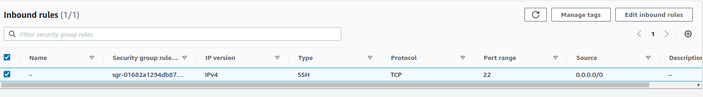

Click "Add Rule" and add entry as shown in the pic. 

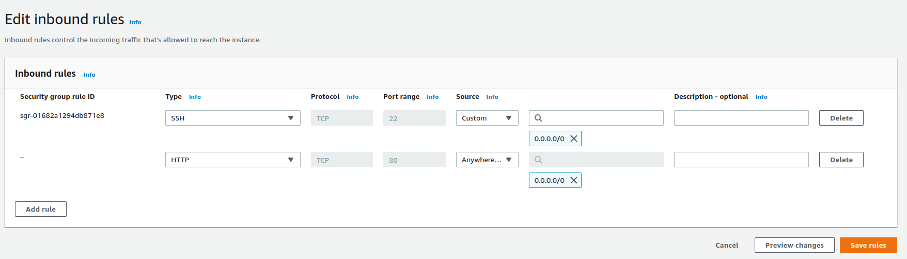
After doing that click "Save Rules"

Verfiy access to server locally by running the curl command:
curl http://localhost:80

verify access through the web browser using your public IP address
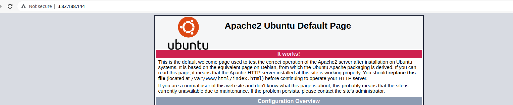

M)ySQL
Database server ........

Installing MySQL
1) On your terminal run the $ sudo apt install command
Next run:
$ sudo apt install mysql-server -y

2)Run security script to remove insecure default settings and lock down access to your database system
$sudo mysql_secure_installation

`VALIDATE PASSWORD PLUGIN can be used to test passwords
and improve security. It checks the strength of password
and allows the users to set only those passwords which are
secure enough. Would you like to setup VALIDATE PASSWORD plugin?

Press y|Y for Yes, any other key for No:`

If you answer “yes”, you’ll be asked to select a level of password validation. Keep in mind that if you enter `2` for the strongest level, you will receive errors when attempting to set any password which does not contain numbers, upper and lowercase letters, and special characters, or which is based on common dictionary words.

`There are three levels of password validation policy:

LOW    Length >= 8
MEDIUM Length >= 8, numeric, mixed case, **and** special characters
STRONG Length >= 8, numeric, mixed case, special characters **and** dictionary              file

Please enter 0 = LOW, 1 = MEDIUM **and** 2 = STRONG: 1`

Regardless of whether you chose to set up the `VALIDATE PASSWORD PLUGIN`, your server will next ask you to select and confirm a password for the MySQL **root** user. This is not to be confused with the **system root**. The **database root** user is an administrative user with full privileges over the database system. Even though the default authentication method for the MySQL root user dispenses the use of a password, **even when one is set**, you should define a strong password here as an additional safety measure. We’ll talk about this in a moment.

If you enabled password validation, you’ll be shown the password strength for the root password you just entered and your server will ask if you want to continue with that password. If you are happy with your current password, enter `Y` for “yes” at the prompt:

`Estimated strength of the password: 100 
Do you wish to continue with the password provided?(Press y|Y for Yes, any other key for No) : y`

For the rest of the questions, press `Y` and hit the `ENTER` key at each prompt. This will remove some anonymous users and the test database, disable remote root logins, and load these new rules so that MySQL immediately respects the changes you have made.

3) When you’re finished, test if you’re able to log in to the MySQL console by typing:

$ sudo mysql

This will connect to the MySQL server as the administrative database user **root**, which is inferred by the use of sudo when running this command. You should see output like this:

`Welcome to the MySQL monitor.  Commands end **with** ; **or** \g.
Your MySQL connection id **is** 11
Server version: 8.0.22-0ubuntu0.20.04.3 (Ubuntu)

Copyright (c) 2000, 2020, Oracle **and**/**or** its affiliates. All rights reserved.

Oracle **is** a registered trademark of Oracle Corporation **and**/**or** its
affiliates. Other names may be trademarks of their respective
owners.

Type 'help;' **or** '\h' **for** help. Type '\c' to clear the current input statement.

mysql>`

To exit the MySQL console, type:

`mysql> exit`

Step 3 — Installing PHP

Installing PHP
In installing PHP, you need to install a module that allows PHP communicate with MySQL and Apache
All 3 packages can be run at on

$ sudo apt install php libapache2-mod-php php-mysql -y

Once the installation is finished, you can run the following command to confirm your PHP version:

$ php -v
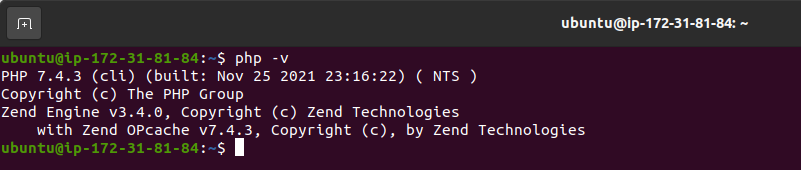

At this point, your LAMP stack is completely installed and fully operational.

- [ ]  [x] **L**inux (Ubuntu)
- [ ]  [x] **A**pache HTTP Server
- [ ]  [x] **M**ySQL
- [ ]  [x] **P**HP

To test your setup with a PHP script, it’s best to set up a proper [Apache Virtual Host](https://httpd.apache.org/docs/2.4/vhosts/) to hold your website’s files and folders. Virtual host allows you to have multiple websites located on a single machine and users of the websites will not even notice it.

Setting up Virtual Host:

In this project, you will set up a domain called `projectlamp`, but you can replace this with any domain of your choice.

Apache on Ubuntu 20.04 has one server block enabled by default that is configured to serve documents from the **/var/www/html** directory. We will leave this configuration as is and will add our own directory next next to the default one.

Create the directory for `projectlamp` using ***‘mkdir’*** command as follows:

$ sudo mkdir /var/www/projectlamp

Next, assign ownership of the directory with the `$USER` environment variable, which will reference your current system user:

`$ sudo chown -R $USER:$USER /var/www/projectlamp`

Then, create and open a new configuration file in Apache’s `sites-available` directory using your preferred command-line editor. Here, we’ll be using `vi` or `vim` (They are the same by the way):

`$ sudo vi /etc/apache2/sites-available/projectlamp.conf`

This will create a new blank file. Paste in the following bare-bones configuration by hitting on `i` on the keyboard to enter the insert mode, and paste the text:

`<VirtualHost *:80>
    ServerName projectlamp
    ServerAlias www.projectlamp 
    ServerAdmin webmaster@localhost
    DocumentRoot /var/www/projectlamp
    ErrorLog ${APACHE_LOG_DIR}/error.log
    CustomLog ${APACHE_LOG_DIR}/access.log combined
</VirtualHost>`

!

You can use the ***`ls`*** command to show the new file in the **sites-available** directory

$ sudo ls /etc/apache2/sites-available

You will see something like this
000-default.conf  default-ssl.conf  projectlamp.conf`

You can now use ***a2ensite*** command to enable the new virtual host:

`$ sudo a2ensite projectlamp`

You might want to disable the default website that comes installed with Apache. This is required if you’re not using a custom domain name, because in this case Apache’s default configuration would overwrite your virtual host. To disable Apache’s default website use ***a2dissite*** command , type:

`$ sudo a2dissite 000-default`

To make sure your configuration file doesn’t contain syntax errors, run:

`$ sudo apache2ctl configtest`

Finally, reload Apache so these changes take effect:

`$ sudo systemctl reload apache2`

Next:
Your new website is now active, but the web root /var/www/projectlamp is still empty. Create an index.html file in that location so that we can test that the virtual host works as expected:

On you command line type the below and replace `with public IP' with your EC2 instance public IP.

`sudo echo 'Hello LAMP from hostname' $(curl -s http://169.254.169.254/latest/meta-data/public-hostname) 'with public IP' $(curl -s http://169.254.169.254/latest/meta-data/public-ipv4) > /var/www/projectlamp/index.html`

Now go to your browser and try to open your website URL using IP address:

`http://<Public-IP-Address>:80`

If you see the text from ‘echo’ command you wrote to index.html file, then it means your Apache virtual host is working as expected. In the output you will see your server’s public hostname (DNS name) and public IP address. 

Step 5 — Enable PHP on the website

the default **DirectoryIndex** settings on Apache, a file named `index.html` will always take precedence over an `index.php` file. This is useful for setting up maintenance pages in PHP applications, by creating a temporary `index.html` file containing an informative message to visitors. Because this page will take precedence over the `index.php` page, it will then become the landing page for the application. Once maintenance is over, the `index.html` is renamed or removed from the document root, bringing back the regular application page.

In case you want to change this behavior, you’ll need to edit the **/etc/apache2/mods-enabled/dir.conf** file and change the order in which the **index.php** file is listed within the **DirectoryIndex** directive:

`sudo vim /etc/apache2/mods-enabled/dir.conf`

New input should look like:

After saving and closing the file, you will need to reload Apache so the changes take effect:

`$ sudo systemctl reload apache2`

Create a new file named `index.php` inside your custom web root folder:

`$ vim /var/www/projectlamp/index.php`

This will open a blank file. Add the following text, which is valid PHP code, inside the file:

`<?php
phpinfo();`

When you are finished, save and close the file, refresh the page and you will see a page similar to this:

Once you verify, remove the index.php file because it contains relevant information about your server.

`$ sudo rm /var/www/projectlamp/index.php`

We have reached the end of the project. We have succesfully deployed a LAMP stack website in AWS.

